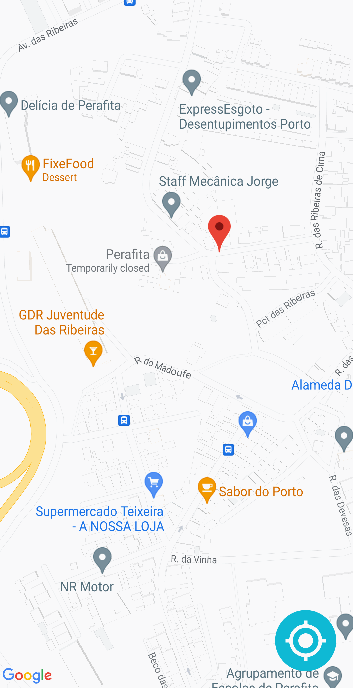

# **MyNearby**

## **1. Introduction**

---

## **2. Functionalities**

### **2.1 Create New Place**

Should the user want or need to **create a new marker**, to, for example, in a more developed version of the application, share with other users who want to explore community catered locations, they can create a new marker by:

- Clicking a non-occupied location on the map;

- Filling both input fields in the pop-up window;

- Completing the task by clicking the "Create New Place" button.

The marker will then appear on the map and can be pressed in order to check the information given by the user in the **info window**.

<table style="margin-left: auto; margin-right: auto;">
    <tr>
        <td></td>
        <td></td>
        <td></td> 
    </tr>
    <tr>
        <td><b>2.1.1</b> Creating new place</td>
        <td><b>2.1.2</b> Failed to fill both fields</td>
        <td><b>2.1.3</b> Checking created place</td>
    </tr>
</table>

### **2.2 Create New Place**

If the user desires to explore a place near their location that is already in the Google Maps database, they can click one of the pre-disposed POI markers to prompt a pop-up displaying pertinent information about that place, such as:

- Location's name;

- Location's type (Restaurant, Bus Station, etc.);

- User ratings and rating amount;

- Establishment's price assessment;

- Location's address;

- Delivery/Dining options;

- Location's Status (Open, Closed, Permanently Closed);

- Establishment's schedule for the current weekday.

The pop-up window's layout also depends on the information in the database, thus only displaying the existing information in an ordered and convenient manor.

<table style="margin-left: auto; margin-right: auto;">
    <tr>
        <td></td>
        <td></td>
        <td></td> 
        <td></td> 
    </tr>
    <tr>
        <td><b>2.2.1</b> Fully Detailed</td>
        <td><b>2.2.2</b> Few Details</td>
        <td><b>2.2.3</b> Temporarily Closed</td>
        <td><b>2.2.4</b> Bus Stop</td>
    </tr>
</table>

### **2.3 Return to Current Location**

In the event of the user losing track of their current position, they can **press the button** on the **bottom right corner** to quickly return to it.

<table style="margin-left: auto; margin-right: auto;">
    <tr>
        <td></td>
    </tr>
    <tr>
        <td><b>2.1.1</b> Return to Current Location</td>
    </tr>
</table>